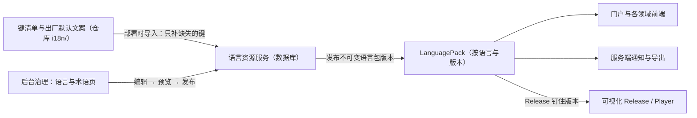

# Titanloom · 国际化与本地化规范

> 版本：V1.0｜日期：2026-10-03｜状态：公共平台规范，随 M1 生效（facilities 项目的语言资源服务）；契约草案见 titanloom-contracts 的 i18n-key-manifest、language-pack、localized-text。
> 定位：把总框架 8.7 的国际化原则落成统一标准：文案存在哪里、怎么命名、怎么写、怎么发布、谁能改、怎么检查。与总框架 8.7 冲突时以总框架为准并先修订本文。
> 依据：总框架 8.7；能力契约 11.3、12；后台治理 6.1、7.1、7.2；插件与扩展体系 7；数据可视化 9.1；ADR-021。

## 1. 原则

1.  **后台数据库是文案的唯一维护处。** 界面、错误、通知与导出的显示文案存放在平台语言资源服务中，在后台治理中心维护；代码中只引用键名，不写显示文案（ADR-021）。
2.  **一种格式。** 前端、服务端通知与导出、插件使用同一种文案格式（第 4 节），不维护第二套模板语法。
3.  **机器标识不翻译。** 资源 ID、API 字段、枚举值、capabilityId、错误码不翻译（总框架 8.7）；用户填写的业务正文与附件不自动翻译。
4.  **键的含义不可变。** 一个键一旦发布，其含义不再改变；含义变化时新建键，旧键弃用。这样代码与文案即使版本不同步也不会显示错误含义。
5.  **默认 zh-CN，首期支持 zh-CN 与 en-US**（总框架 8.7）。

## 2. 三类可显示文本

| 类别 | 例子 | 存放与维护 |
| --- | --- | --- |
| 内置文案 | 按钮、菜单、提示、错误、通知模板、导出表头 | 语言资源服务（数据库），按键名引用；本文主要规范的对象 |
| 配置数据中的名称 | 表单字段名、FieldRef 标签、指标名、角色名、空间名 | 随所属对象存放，类型为 LocalizedText（第 7 节），由对象所属领域维护 |
| 高代码页面与插件自带文案 | 可视化页面内文字、插件界面文字 | 随可视化 Release 或插件包版本存放，使用第 4 节格式与第 3 节键名（插件用 `plugin.<pluginId>` 命名空间）；平台内置文案仍以语言资源服务为准 |
| 业务正文 | 填报内容、知识文档正文、问题描述、附件 | 原样存放，不翻译 |

## 3. 键名

-   格式：`命名空间:路径`，例如 `attendance:schedule.publishConfirm`、`errors:resourceVersionConflict`。
-   命名空间：开发项目名（`attendance`、`dataproc`、`visualization` 等，见开发项目划分规范 2.2），项目名含连字符的去掉连字符改用简称（plugin-host 项目用 `plugins`）；另有 `common`（通用词，归 shell 项目）、`errors`（错误码文案，归 contracts 项目）。插件使用 `plugin.<pluginId>` 命名空间（插件与扩展体系 7）。
-   路径：小驼峰分段，用点分隔，按页面或功能区组织；不以显示文字命名键（不写 `attendance:确定`）。
-   错误码的键由错误码机械推导：`VERSION_CONFLICT` → `errors:versionConflict`；错误码注册表记录该键（契约测试检查一致）。
-   每个键在键清单中登记：命名空间、路径、参数名与类型、用途说明、是否关键文案（第 6 节）、出现位置。

## 4. 文案格式

-   沿用总框架选定的 i18next 资源格式：参数写作 `{{name}}`；复数用 CLDR 复数类别后缀（如 `_one`、`_other`）；不拼接句子，不在文案中写 HTML 或脚本。
-   数字、金额、百分比、日期与时间不写进文案字符串，以参数传入并按格式类型格式化（第 8 节），例如 `{{hours, number}}`、`{{workDate, date}}`。
-   服务端用同一份资源渲染通知与导出：参数插值与复数后缀由平台的薄适配层实现，复数类别与数字、日期格式使用 Babel；Babel 与浏览器 Intl 同样基于 CLDR，中英文格式化结果须有一致性测试。
-   同一个键在 zh-CN 与 en-US 中的参数集合必须相同；en-US 需要的复数形式必须齐全。

## 5. 存放、种子与发布

### 5.1 运行时

-   语言资源服务归 facilities 项目，后台页面归 admin 项目（开发项目划分规范 2.2）。
-   后台编辑产生修订，发布后形成不可变的 LanguagePack 版本，激活沿用配置修订与激活分离（后台治理 7.2），可预览、可回退、有审计。语言包属于后台治理 7.1 的"业务公共配置"。
-   前端按语言与命名空间加载已激活语言包，按版本长缓存；可视化 Release 钉住语言包版本，修改文案产生新 Release 才会到达现场（总框架 8.7、可视化 9.1）；Player 离线包随 Release 打包对应语言包快照。
-   服务端通知与导出记录所用语言包版本、语言与时区，重试不随设置漂移（总框架 8.7）。

### 5.2 键清单与出厂默认文案

仓库根目录只有一个 `i18n/` 目录，按命名空间一个文件，例如 `i18n/attendance.yaml`，内容为键清单与 zh-CN / en-US 出厂默认文案。它的作用只是"首次投放"：

-   部署或升级时导入数据库，**只补数据库中不存在的键**，从不覆盖后台已维护的文案。部署后文案只在后台维护。
-   新功能随代码提交其新增键与默认文案，因此新部署开箱即有完整中英文，新功能上线不会出现空白文案。
-   键清单由代码中引用的键自动提取校对：代码用到而清单未登记的键使 CI 失败；清单中无人引用的键给出警告并在弃用后移除。
-   开发项目只修改自己命名空间对应的文件（开发项目划分规范 6 的范围检查）。

已上线键的显示文字需要调整时，在后台修改；需要改变含义时新建键（第 1 节第 4 条），不修改出厂默认文案来"推送"新文字。

## 6. 关键文案与权限

-   **关键文案**：确认界面、撤权与安全提示、数据外发与删除警告等。键清单中标记为关键；其修改权限单独授予，修改须双语同时提交并审计；关键文案缺失任一语言时，语言包不得激活（能力契约 11.3、总框架 8.7）。
-   确认界面的关键文案由平台受控模板生成，插件、Skill 与普通空间配置不得覆盖（能力契约 11.3）。
-   一般文案的编辑权限按后台治理角色授予；空间与项目不覆盖平台文案（首期不提供按空间覆盖）。
-   语言资源接口只返回显示文案，不返回业务数据；修改不改变任何授权、ID 或业务语义。

## 7. LocalizedText（配置数据中的名称）

-   契约类型 `LocalizedText`：`{"zh-CN": "部门", "en-US": "Department"}`，键为 BCP 47 语言标签；zh-CN 必填。
-   显示时取用户语言，缺失时回退 zh-CN，并在管理界面标记"未翻译"。
-   名称属于所属对象的配置版本，随对象版本化与发布；不进入语言资源服务。
-   用于检索时，两种语言的值都参与检索；不作为任何对象的标识。

## 8. 格式化分工

| 场景 | 由谁格式化 | 规则 |
| --- | --- | --- |
| 界面显示 | 前端 | API 返回原始值：ISO 8601 时间、字符串编码的精确小数、代码；前端按用户语言与显示时区用 Intl 格式化（数据处理 12.3、总框架 8.7） |
| 通知与导出 | 服务端 | 固定语言、时区、模板与语言包版本，用 Babel 格式化并记录（总框架 8.7） |
| 业务日期与归属日 | 领域服务 | 按业务时区确定，显示时区变化不改变归属日或指标口径 |

API 不返回为某种语言预先格式化的字符串（错误与提示返回键名与参数）。

## 9. 回退与缺失

-   回退链：用户语言 → zh-CN。两者都缺失时，生产环境显示键名并记录缺失指标；开发与测试环境醒目标出缺失。
-   后台"语言与术语"页显示各命名空间、各语言的覆盖率、缺失与过期项（键清单变更后待复核的文案）。
-   关键文案缺失时阻止语言包激活（第 6 节）。

## 10. 术语表

-   中英术语表在后台"语言与术语"页维护，记录领域词（如排班、申报、正式结果、Release、Take）的标准中英文、定义与禁用译法；初始版本随 `i18n/glossary.yaml` 导入，规则同第 5.2 节。
-   编写默认文案与后台修改文案都应使用术语表用词；后台在编辑时提示与术语表不一致的用词。

## 11. 检查与验收

| 检查 | 方式 | 时点 |
| --- | --- | --- |
| 界面无字面量文案 | 前端静态检查（工程质量规范 4.2） | M0 起 |
| 代码引用的键均已登记 | 键提取与键清单比对，CI 失败即拦截 | M1 起 |
| 双语参数集合一致、en-US 复数齐全 | 键清单校验 | M1 起 |
| 错误码均有文案键 | 错误码注册表契约测试 | 已生效 |
| 服务端与前端格式化一致 | 对同一组数字、日期、复数用例比较两端输出 | M1 |
| 导入只补不覆盖 | 集成测试：后台改过的文案在再次导入后不变 | M1 |
| 关键文案缺失时语言包不能激活 | 集成测试 | M4（语言页上线） |
| 双语界面验收 | 长文本、按钮、数字位数、图例、导出（总框架 8.7） | 各里程碑 |

## 12. 未纳入首期

-   RTL 语言（总框架 8.7）。
-   按空间或项目覆盖平台文案。
-   机器翻译辅助：如引入，只生成待复核的建议，不直接发布，且不因此扩大模型输入（总框架 8.7）。
