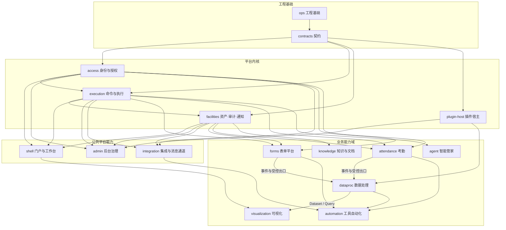
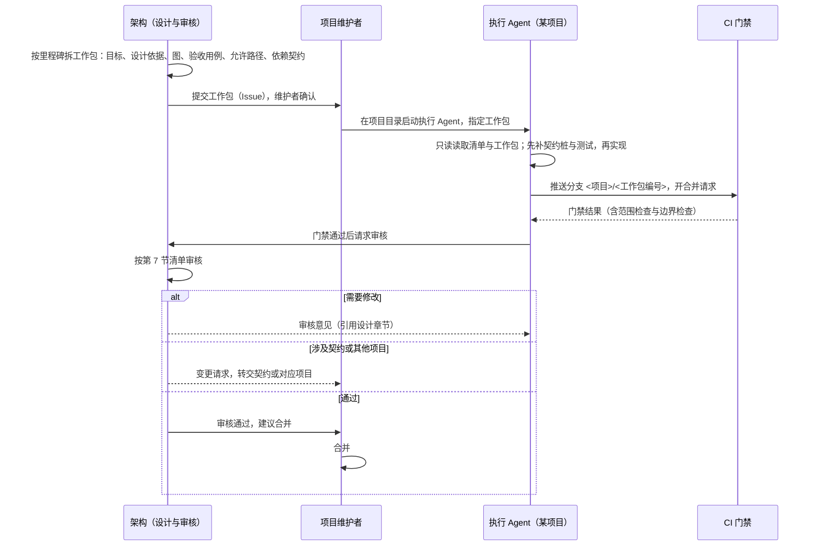

# Titanloom · 开发项目划分与多 Agent 协作规范

> 版本：V1.0｜日期：2026-10-03｜修订：2026-10-04 forms 项目显示名改为表单平台（key 不变）；shell 增公告与移动端导航，admin 增业务参数页；2026-10-05 shell 增工作台默认卡片与"我发起的"聚合｜状态：公共平台规范，随 M0 生效；项目清单与读取清单在 M0 落成仓库中的清单文件与各项目 Agent 说明。
> 定位：规定开发工作如何按子方案拆成开发项目、每个项目的执行 Agent 读什么、能改什么，以及"架构设计 → Agent 执行 → 审核"的流程。本文不改变运行时架构：系统仍是总框架规定的模块化单体，项目划分只是开发分工；模块边界、对象 Owner 与公共契约以总框架、能力契约和各子方案为准。
> 依据：总框架 4、5、8.1、14；能力契约 2、13；实施路线 3、5；《Titanloom-工程质量与代码规范》；ADR-020。

## 1. 原则

1.  **一个子方案一个项目。** 每个业务能力域、每个公共平台能力是一个开发项目；平台内核按能力契约的职责拆成三个项目，避免单个项目的必读材料过大。
2.  **单仓分目录。** 所有项目在同一个仓库中，各占自己的目录（ADR-020）。运行时仍是模块化单体。
3.  **上下文按需。** 执行 Agent 只读本项目子方案全文、本文第 4 节列出的公共规范章节与相关契约文件；其他子方案只在工作包明确引用时读取对应章节。
4.  **只改自己的目录。** 执行 Agent 只修改本项目目录；需要改契约或别的项目时提交变更请求，由架构审核后交给对应项目执行。CI 检查强制这一点。
5.  **跨项目只走契约。** 项目之间只经契约生成的 SDK、Capability / Command 与已发布事件交互（总框架 5、能力契约 2.1）。依赖项目尚未实现时，用契约生成的桩实现开发，契约测试保证桩与真实实现一致。
6.  **先设计后执行，执行后审核。** 架构（本仓库的设计维护者与 Claude 架构会话）负责出工作包与审核；执行 Agent 负责实现；项目维护者负责最终合并。

## 2. 项目清单

### 2.1 项目依赖



箭头表示"依赖其契约与能力"，不表示代码导入；所有依赖都经契约（第 1 节第 5 条）。契约项目被所有项目依赖，图中只画出与内核的连接。

### 2.2 项目表

| 项目 | 负责的方案 | 拥有的对象与职责（摘要） | 服务端目录 | 前端目录 | 主要里程碑 |
| --- | --- | --- | --- | --- | --- |
| ops 工程基础 | 实施路线 5.3、工程质量规范、部署拓扑 | 仓库骨架、工具链、CI 与门禁、合成数据生成器、性能脚手架、部署与恢复脚本、本文清单文件 | `ops/`、`.github/`、根配置 | 前端工具链配置 | M0；M4 基准与恢复 |
| contracts 契约 | 能力契约 3、12 与各方案中的契约 | JSON Schema、OpenAPI、状态机、错误码注册表及其 `errors` 文案键、事件信封、SDK 生成 | `packages/contracts`、`packages/sdk-*` | — | M0 起持续 |
| access 身份与授权 | 能力契约 5；总框架 3.1、3.1.1、8.5；后台治理 4、5.1 | Principal / Group / ServicePrincipal、Person / Employment / SourceIdentity、Workspace / BusinessProject、角色与绑定、策略版本、委托、Agent 运行端、三道门与授权判定 | `apps/api/titanloom/access` | — | M1 |
| execution 命令与执行 | 能力契约 3、6、7、8、13、14；总框架 12.4、13 | 能力目录、命令、确认、调用、幂等记录、outbox、JobRun / JobAttempt、有界本地 Runner、控制服务（调度、分派、租约与核对） | `apps/api/titanloom/execution` | — | M1 |
| facilities 资产·审计·通知 | 总框架 8.7、9；能力契约 9.4；后台治理 11.1、11.3、12.2；国际化规范 | Asset 服务（稳定 ID、版本、派生规格、访问授权）、AuditEvent、Notification 与待办投递、语言资源服务（文案、语言包、术语表、默认文案导入、服务端渲染适配层） | `apps/api/titanloom/facilities` | — | M1；通知 M4 |
| plugin-host 插件宿主 | 插件与扩展体系；总框架 8.6 | 清单与签名校验、Contribution / Binding / Host、服务契约与组合版本、运行实例生命周期、宿主 SDK；隔离宿主（G-ISO） | `apps/api/titanloom/plugin_host`、`packages/host-sdk` | — | M1 阶段 A；M2–M3 B1；M6 B2、C |
| shell 门户与工作台 | Shell 与门户及个人工作台 | 导航（含移动端）、资源路由、ShellContext、WorkspacePage / Version、全平台待办、"我发起的"与搜索入口、工作台默认卡片、公告与阅读回执、启动体验；前端应用框架与公共 UI 组件；`common` 命名空间文案 | `apps/api/titanloom/shell` | `apps/web/src/shell`、`apps/web/src/shared` | M1 A1；M4 A2；M6 B–C |
| admin 后台治理 | 后台治理中心 | 治理投影、配置修订与激活、配额与预留、依赖图与运行图、权限诊断、平台告警、备份恢复入口、集成中心页面承载、业务参数页（ADR-022）、语言与术语页 | `apps/api/titanloom/admin` | `apps/web/src/domains/admin` | M0 P0；M1 P1；M4 P2–P3 |
| integration 集成与消息通道 | 集成与消息通道 | ChannelConnection、DeliveryRoute、模板、投递记录、InboundEndpoint / InboundRoute、出网守卫、SecretRef 最小集 | `apps/api/titanloom/integration` | `apps/web/src/domains/integration` | M4 出站；M5 入站 |
| forms 表单平台 | 表单平台 | RecordType、BusinessRecord / RecordRevision、导入、WorkflowInstance / HumanTask、L0 表单运行 | `apps/api/titanloom/forms` | `apps/web/src/domains/forms` | M2；M5 阶段二 |
| attendance 考勤 | 考勤签到 | 班次与排班、签到证据、申报与修订、额度、正式结果、AttendanceAlert、导出适配 | `apps/api/titanloom/attendance` | `apps/web/src/domains/attendance` | M2；M5 阶段二 |
| dataproc 数据处理 | 数据处理 | DataSource、Raw / Standard、Pipeline / DAG、PipelineRun、质量与 Quarantine、业务基表、Dataset / Query、FieldRef、语义契约、血缘 | `apps/api/titanloom/dataproc` | `apps/web/src/domains/dataproc` | M3；M6 Phase 3 |
| visualization 可视化 | 数据可视化控制台 | Project / Page / Release、Runtime 与 Data SDK、筛选与报表、Show / Display / Player、ReportDefinition / Instance | `apps/api/titanloom/visualization` | `apps/web/src/domains/visualization`、`apps/player` | M4 A1；M6 A2、B、C |
| automation 工具自动化 | 工具自动化平台 | Tool / ToolVersion、AutomationPlan、TriggerBinding / Occurrence、AutomationRun / StepExecution | `apps/api/titanloom/automation` | `apps/web/src/domains/automation` | M5 |
| knowledge 知识与文档 | 知识与文档平台 | KnowledgeSpace、Document / Block、KnowledgeVersion、关系、Issue / Suggestion | `apps/api/titanloom/knowledge` | `apps/web/src/domains/knowledge` | M5 A–B；M6 C |
| agent 智能管家 | 智能管家 | AgentTask、Goal / PlanVersion / AgentStep、上下文与恢复点、Model Adapter 契约 | `apps/api/titanloom/agent` | `apps/web/src/domains/agent` | M5；M6 |

每个项目还拥有仓库根目录 `i18n/` 中与本项目命名空间同名的键清单文件（国际化规范 5.2），以及自己目录下的数据库迁移（`<服务端目录>/migrations`）与测试（`<服务端目录>/tests`、前端目录下的测试）。跨项目的端到端测试放在 `tests/e2e`，由 ops 项目维护，用例来自各方案的验收章节。

## 3. 里程碑中的并行安排

| 里程碑 | 同时进行的项目 |
| --- | --- |
| M0 | ops、contracts、admin（P0 契约与模型） |
| M1 | access、execution、facilities、plugin-host（A）、shell（A1）、admin（P1） |
| M2 | forms、attendance、plugin-host（B1 文件解析器） |
| M3 | dataproc、contracts（Query 与 Pipeline 契约）、plugin-host（B1 内置算子） |
| M4 | visualization（A1）、shell（A2）、admin（P2–P3）、integration（出站）、facilities（通知）、ops（基准与恢复） |
| M5 | integration（入站）、automation、agent、forms 与 attendance（阶段二）、knowledge（A–B） |
| M6 | visualization（A2、B、C）、shell（B–C）、knowledge（C）、plugin-host（B2、C）、dataproc（Phase 3） |

同一里程碑内的项目可并行执行；依赖未就绪的部分使用契约桩。里程碑出口以实施路线第 5 节为准，跨项目验收由架构在里程碑末统一安排。

## 4. 读取清单

### 4.1 所有项目共同必读

-   《Titanloom-工程质量与代码规范》全文。
-   《Titanloom-国际化与本地化规范》第 1–5、7–9 节（facilities 与 admin 读全文）。
-   本文第 1、2.2、5、6 节。
-   总框架第 4、5 节（领域边界与总体关系）。
-   能力契约第 2、3、12 节（结构、能力契约、错误语义）。
-   本项目相关的 ADR（按工作包列出）。
-   `packages/contracts` 中本项目拥有或调用的 Schema。

### 4.2 各项目追加

| 项目 | 本项目方案 | 追加的公共规范章节 |
| --- | --- | --- |
| ops | 实施路线全文、部署拓扑全文 | 总框架 12；开源与第三方依赖治理 |
| contracts | 能力契约全文 | 总框架 8.2–8.3、13.1；各方案中被登记为契约的章节（按工作包） |
| access | — | 能力契约 5、6.4；总框架 3.1、3.1.1、8.5；后台治理 4、5.1 |
| execution | — | 能力契约 6、7、8、13、14；总框架 12.4、13；部署 4 |
| facilities | — | 能力契约 9.4；总框架 8.7、9；后台治理 11.1、11.3、12.2 |
| plugin-host | 插件与扩展体系全文 | 总框架 8.6；ADR-013、ADR-016 |
| shell | Shell 与门户及个人工作台全文 | 总框架 3、3.2、8.7；可视化 2.1（门户主页嵌入，按工作包） |
| admin | 后台治理中心全文 | 能力契约 5、8；集成与消息通道 5（集成中心页面） |
| integration | 集成与消息通道全文 | 后台治理 7.2、10.3；能力契约 6 |
| forms | 表单平台全文 | 能力契约 6、7；插件体系 2（宿主登记） |
| attendance | 考勤签到全文 | 能力契约 6、7、8；总框架 8.7（时间口径） |
| dataproc | 数据处理全文 | 能力契约 8、9；插件体系 2、8；ADR-016 |
| visualization | 数据可视化控制台全文 | 能力契约 9；数据处理 12（Dataset / Query / FieldRef）；Shell 7 |
| automation | 工具自动化全文 | 能力契约 6、7、8；集成与消息通道 4；ADR-016 |
| knowledge | 知识与文档全文 | 能力契约 9.4；总框架 9 |
| agent | 智能管家全文 | 能力契约 4、5、6、9.3、10、11 |

读取清单是下限：工作包可以追加具体章节；执行 Agent 发现需要清单外的设计依据时，先在工作包中提出，不自行扩大阅读与修改范围。

## 5. 工作流程



### 5.1 工作包

每个工作包是一个 Issue，标注项目与里程碑，内容固定为：

1.  **目标**：一句话说明完成后系统能做什么。
2.  **设计依据**：精确到节的引用；工作包不得引入设计中没有的行为。
3.  **图**：涉及的对象、状态迁移或调用链（必要时）。
4.  **接口**：本工作包提供与调用的 capabilityId、事件类型、Schema 文件。
5.  **验收用例**：取自方案的验收章节，写成可执行测试的形式。
6.  **允许修改的路径**：默认为本项目目录；例外须在此列出并说明。
7.  **不做的事**：明确排除的范围，防止执行 Agent 顺手扩张。

工作包大小以一个合并请求能审完为限；超过时拆分。

### 5.2 跨项目变更请求

执行 Agent 发现需要修改契约或其他项目时，不自行修改，而是提交变更请求 Issue，写明：需要什么、为什么、对应设计章节、对调用方的影响。架构判断是否需要先改设计；需要改契约的交给 contracts 项目，需要改其他项目的生成该项目的工作包。在变更合并前，提出方使用桩继续开发或暂停相关部分。

### 5.3 设计偏差

执行中发现设计不可行、矛盾或缺失时，执行 Agent 停止相关部分并报告，不按自己的理解补设计。架构先修订设计文档（必要时写 ADR），再更新工作包。这与工程质量规范第 1 节第 2 条一致。

## 6. 范围与边界的强制

| 机制 | 作用 | 落成时点 |
| --- | --- | --- |
| 项目清单文件 | 机器可读地登记每个项目的目录、读取清单与允许路径（本文附录 A） | M0 |
| 各项目 Agent 说明 | 每个项目目录放一份 Agent 说明（如 `CLAUDE.md`），写明读取清单、允许路径、禁止事项与提交约定；执行 Agent 在该目录启动时自动加载 | M0 建模板，各项目首个工作包落成 |
| 范围检查 | CI 按分支名前缀识别项目，合并请求改动了允许路径以外的文件即失败；工作包登记的例外除外 | M0 |
| 导入边界检查 | 服务端模块只能导入其他模块的对外接口层；前端领域目录互不导入 | M0（工程质量规范 2.2、2.3） |
| 数据库角色 | 每个项目的迁移只授予本 schema 写权限，集成测试以项目角色连接 | M1 |
| 契约一致性 | 桩与真实实现跑同一组契约测试 | M1 |

## 7. 审核清单

架构审核每个合并请求时逐项检查：

1.  **设计一致**：实现的行为都能在工作包引用的设计章节中找到依据；没有引入设计外的行为、对象或状态。
2.  **边界**：只改了允许路径；没有跨模块导入内部实现、没有直接访问他人数据；对象 Owner 与总框架一致。
3.  **契约**：能力、事件、错误码、状态迁移与契约一致；生成物未手改；破坏性变更已声明。
4.  **测试**：工作包的验收用例全部有对应测试；权限有拒绝用例；涉及状态的有不变量测试；涉及命令或 Job 的有故障注入测试。
5.  **质量**：符合工程质量规范第 4 节编码规则与第 6 节完成的定义。
6.  **可维护性**：命名表达领域语义；没有重复实现公共能力；没有为未来需求预先堆砌的抽象；复杂处有说明。
7.  **安全**：没有秘密与不必要的业务明细进入日志；G-ISO 前没有执行用户代码的路径；出网与入站经守卫。

审核意见必须引用具体文件位置与设计章节；"感觉不好"不是有效意见。

## 8. 与其他文档的关系

-   项目对应的里程碑与出口条件以实施路线为准；本文第 3 节只是按项目重排。
-   代码规则以工程质量规范为准；本文只增加项目范围与协作流程。
-   新增子方案时同步新增项目；子方案合并或拆分时，先改本文与清单文件，再迁移目录。

## 附录 A　项目清单文件（M0 落成为仓库根目录的 `projects.yaml`）

```yaml
# 字段：paths 为允许修改的路径；read 为读取清单（除第 4.1 节共同必读外）
ops:
  paths: [ops/, .github/, tests/e2e/, pyproject.toml, package.json, pnpm-workspace.yaml, uv.lock, pnpm-lock.yaml]
  read: [实施路线, 部署拓扑与容量规划, 总框架#12, 开源与第三方依赖治理]
contracts:
  paths: [packages/contracts/, packages/sdk-python/, packages/sdk-typescript/, i18n/errors.yaml]
  read: [平台能力契约与Agent接入规范, 总框架#8.2, 总框架#8.3, 总框架#13.1]
access:
  paths: [apps/api/titanloom/access/, i18n/access.yaml]
  read: [平台能力契约#5, 平台能力契约#6.4, 总框架#3.1, 总框架#3.1.1, 总框架#8.5, 后台治理#4, 后台治理#5.1]
execution:
  paths: [apps/api/titanloom/execution/, i18n/execution.yaml]
  read: [平台能力契约#6, 平台能力契约#7, 平台能力契约#8, 平台能力契约#13, 平台能力契约#14, 总框架#12.4, 总框架#13, 部署拓扑#4]
facilities:
  paths: [apps/api/titanloom/facilities/, i18n/facilities.yaml, i18n/glossary.yaml]
  read: [平台能力契约#9.4, 总框架#8.7, 总框架#9, 后台治理#11.1, 后台治理#11.3, 后台治理#12.2]
plugin-host:
  paths: [apps/api/titanloom/plugin_host/, packages/host-sdk/, i18n/plugins.yaml]
  read: [插件与扩展体系, 总框架#8.6, ADR-013, ADR-016]
shell:
  paths: [apps/api/titanloom/shell/, apps/web/src/shell/, apps/web/src/shared/, i18n/common.yaml, i18n/shell.yaml]
  read: [Shell与门户及个人工作台, 总框架#3, 总框架#8.7]
admin:
  paths: [apps/api/titanloom/admin/, apps/web/src/domains/admin/, i18n/admin.yaml]
  read: [后台治理中心, 平台能力契约#5, 平台能力契约#8, 集成与消息通道#5]
integration:
  paths: [apps/api/titanloom/integration/, apps/web/src/domains/integration/, i18n/integration.yaml]
  read: [集成与消息通道, 后台治理#7.2, 后台治理#10.3, 平台能力契约#6]
forms:
  paths: [apps/api/titanloom/forms/, apps/web/src/domains/forms/, i18n/forms.yaml]
  read: [表单平台, 平台能力契约#6, 平台能力契约#7, 插件与扩展体系#2]
attendance:
  paths: [apps/api/titanloom/attendance/, apps/web/src/domains/attendance/, i18n/attendance.yaml]
  read: [考勤签到, 平台能力契约#6, 平台能力契约#7, 平台能力契约#8, 总框架#8.7]
dataproc:
  paths: [apps/api/titanloom/dataproc/, apps/web/src/domains/dataproc/, i18n/dataproc.yaml]
  read: [数据处理, 平台能力契约#8, 平台能力契约#9, 插件与扩展体系#2, 插件与扩展体系#8, ADR-016]
visualization:
  paths: [apps/api/titanloom/visualization/, apps/web/src/domains/visualization/, apps/player/, i18n/visualization.yaml]
  read: [数据可视化控制台, 平台能力契约#9, 数据处理#12, Shell与门户及个人工作台#7]
automation:
  paths: [apps/api/titanloom/automation/, apps/web/src/domains/automation/, i18n/automation.yaml]
  read: [工具自动化, 平台能力契约#6, 平台能力契约#7, 平台能力契约#8, 集成与消息通道#4, ADR-016]
knowledge:
  paths: [apps/api/titanloom/knowledge/, apps/web/src/domains/knowledge/, i18n/knowledge.yaml]
  read: [知识与文档, 平台能力契约#9.4, 总框架#9]
agent:
  paths: [apps/api/titanloom/agent/, apps/web/src/domains/agent/, i18n/agent.yaml]
  read: [智能管家, 平台能力契约#4, 平台能力契约#5, 平台能力契约#6, 平台能力契约#9.3, 平台能力契约#10, 平台能力契约#11]
```
